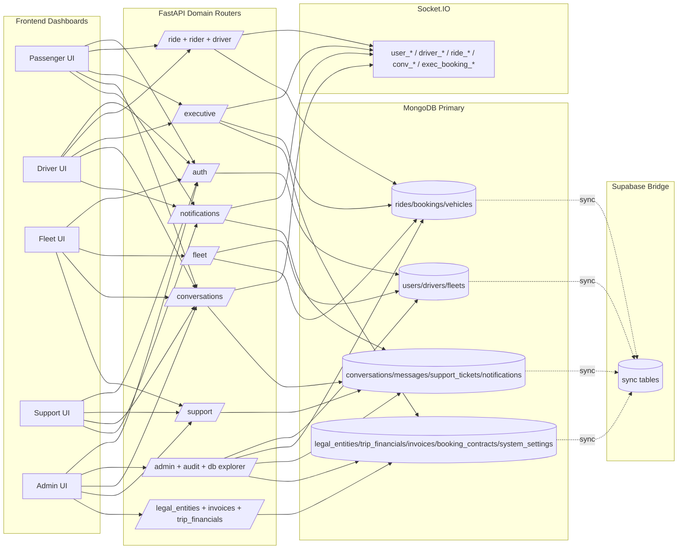
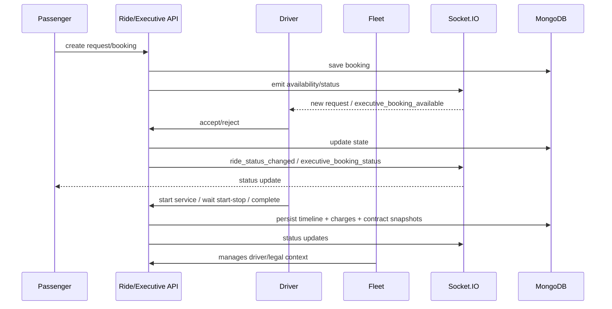
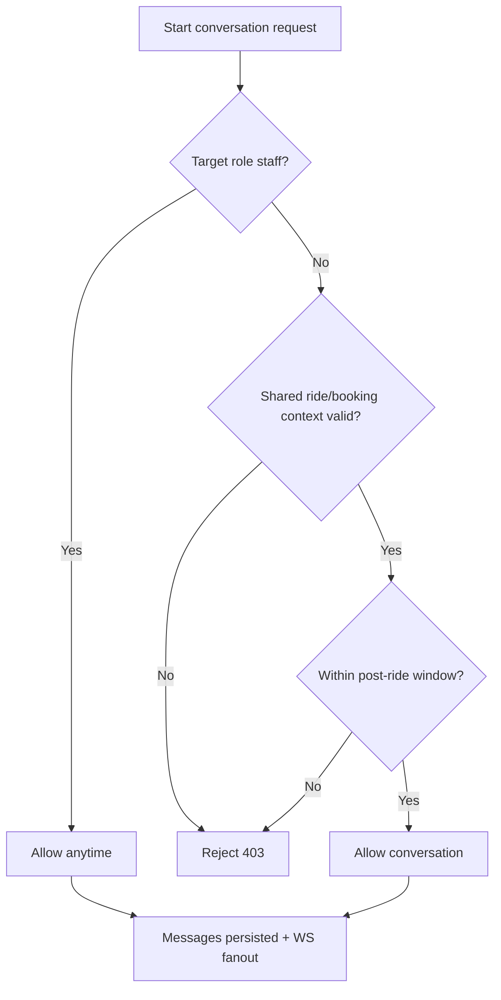

# Brainmap Complet Multi-Rol (User + Driver + Fleet + Support + Admin)

Data: 2026-03-01  
Scope: platforma `premium.private-driver.ro` (frontend + backend + realtime + data layer), consolidat pentru vizualizare automată în alt AI.

## 1) Entry Points + Guards pe rol

| Rol | Entrypoint UI | Guard frontend | Navigație principală | Layout/Container |
|---|---|---|---|---|
| Passenger (`user`) | `/v2/passenger` | `ProtectedRoute requiredRoles=['user']` | bottom nav + home sheet + profile/settings submenus | `BottomNavigation` + pagini passenger |
| Driver (`driver`) | `/v2/driver` | `ProtectedRoute requiredRoles=['driver']` | bottom nav + home sheet + profile/settings | `BottomNavigation` + pagini driver |
| Fleet (`fleet_manager`) | `/fleet/dashboard` | `ProtectedRoute requiredRoles=['fleet_manager']` | sidebar fleet | `FleetLayout` |
| Support (`support`) | `/support/dashboard` | `ProtectedRoute requiredRoles=['support']` | sidebar support | `SupportLayout` |
| Admin (`admin`) | `/admin/dashboard` | `ProtectedRoute requiredRoles=['admin']` | sidebar admin | `AdminLayout` |

Surse routing: `src/App.tsx`  
Surse meniuri: `src/components/admin/AdminLayout.tsx`, `src/components/fleet/FleetLayout.tsx`, `src/components/support/SupportLayout.tsx`, `src/components/shared/BottomNavigation.tsx`, `src/pages/passenger/Home.tsx`, `src/pages/driver/Home.tsx`.

## 2) Meniuri consolidate pe rol

### Passenger
- Bottom nav: `Acasă`, `Mesaje`, `Istoric`, `Profil`.
- Home sheet: `Cursele tale`, `Metode de plată`, `Promoții`, `Setări`, `Ajutor & Suport`.
- Profile: `Plăți`, `Locații salvate`, `Promoții`, `Setări`, `Ajutor`, `Legal`.
- Settings subroutes: `Limbă`, `Privacy`, `Trusted devices`, `Notification settings`.

### Driver
- Bottom nav: `Acasă`, `Istoric`, `Câștiguri`, `Profil`.
- Home sheet: `Notificări`, `Mesaje`, `Premium`, `Documente`, `Vehicul`, `Câștiguri`, `Setări`, `Ajutor`.
- Profile: `Vehicle Details`, `Settings`, `Help & Support`.
- Settings sections: `Premium`, `Appearance`, `Driving preferences`, `Notifications`, `Navigation`.

### Fleet
- Sidebar: `Dashboard`, `Vehicles`, `Drivers`, `Trips`, `Earnings`, `Reports`, `Messages`, `Support`, `Settings`.

### Support
- Sidebar: `Dashboard`, `Tickets`, `Messages`, `Notifications`.

### Admin
- Sidebar: `Dashboard`, `Trips`, `Users`, `Drivers`, `Premium Apps`, `Fleets`, `Vehicles`, `Payments`, `Financial Mgmt`, `Pricing`, `Disputes`, `Feedback`, `Audit Logs`, `Analytics`, `Invoices`, `Document Verification`, `Messages`, `Support Tickets`, `Promotions`, `Referrals`, `Settings`, `Database Explorer`, `Project Map`.

## 3) Backend domenii funcționale (single source API)

- Auth & RBAC: `/api/auth/*`, `ProtectedRoute` + backend role checks.
- Ride standard: `/api/rides/*`, `/api/rider/rides*`, `/api/driver/rides*`.
- Executive booking: `/api/executive/*`, `/api/driver/bookings/*`.
- Fleet operations: `/api/fleet/*` (drivers, vehicles, trips, settings, legal entity, invitations).
- Support operations: `/api/support/*` (tickets, assignment, canned responses, analytics).
- Messaging: `/api/conversations/*` (list, contacts, create, messages, search, read).
- Notifications: `/api/notifications/*` (list, register/unregister push, preferences, read/clear).
- Admin control plane: `/api/admin/*`, plus `/api/audit/*`, `/api/admin/db/*`, `/api/admin/project-map/*`.
- Financial/compliance: `/api/legal-entities/*`, `/api/trip-financials/*`, `/api/invoices/*`, `/api/documents/*`.

## 4) Interacțiuni cross-role (business links)

| From | To | Canal | Reguli |
|---|---|---|---|
| Passenger | Driver | ride request / booking + chat | chat direct permis doar cu context ride/booking eligibil |
| Passenger | Support/Admin/Fleet | messaging + support tickets | inițiere permisă oricând pentru canale staff |
| Driver | Passenger | accept/reject/status update + chat | ownership + context checks pe ride endpoints |
| Driver | Fleet | operational management | driver onboarding este invite-only din flotă |
| Fleet | Driver | invites, status, vehicule, trips | driver trebuie legat de `fleet + legal entity` |
| Support | Toți | tickets + conversații | suport operațional cross-role |
| Admin | Toți | settings/policies/compliance/finance | control-plane global, impact asupra tuturor fluxurilor |

## 5) Realtime map (Socket.IO)

Rooms:
- personal: `user_{id}`, `driver_{id}`
- ride: `ride_{ride_id}`
- conversation: `conv_{conversation_id}`
- executive booking: `exec_booking_{booking_id}`

Events principale:
- Ride lifecycle: `new_ride_request`, `ride_accepted`, `ride_started`, `ride_completed`, `ride_status_changed`, `driver_location`.
- Messaging: `join_conversation`, `message:new`, `message:read`, `typing:indicator`.
- Executive lifecycle: `executive_booking_status`, `executive_booking_available`.

## 6) Data layer map

MongoDB (primar):
- Identity/RBAC: `users`, `drivers`, `fleets`, `driver_invitations`.
- Operations: `rides`, `bookings`, `driver_settings`, `driver_premium`, `vehicles`.
- Communications: `conversations`, `messages`, `support_tickets`, `notifications`.
- Legal/finance: `legal_entities`, `trip_financials`, `invoices`, `booking_contracts`, `service_packages`, `system_settings`.
- Compliance/audit: `documents`, audit collections.

Supabase (bridge/sync):
- sync operational tables pentru interop (ex. `users`, `drivers`, `conversations`, `messages`, `support_tickets`, `vehicle_documents`, `audit_logs`), fără a deveni DB principal.

## 7) Mermaid — Topologie completă



## 8) Mermaid — Ride/Booking lifecycle cross-role



## 9) Mermaid — Messaging privacy model



## 10) Graph JSON (pentru AI de vizualizare)

```json
{
  "meta": {
    "name": "premium-private-driver-all-roles",
    "date": "2026-03-01",
    "source": "code + role audits",
    "version": "1.0"
  },
  "nodes": [
    { "id": "role_user", "label": "Passenger", "type": "role" },
    { "id": "role_driver", "label": "Driver", "type": "role" },
    { "id": "role_fleet", "label": "Fleet Manager", "type": "role" },
    { "id": "role_support", "label": "Support", "type": "role" },
    { "id": "role_admin", "label": "Admin", "type": "role" },

    { "id": "ui_passenger", "label": "/v2/passenger", "type": "ui" },
    { "id": "ui_driver", "label": "/v2/driver", "type": "ui" },
    { "id": "ui_fleet", "label": "/fleet/dashboard", "type": "ui" },
    { "id": "ui_support", "label": "/support/dashboard", "type": "ui" },
    { "id": "ui_admin", "label": "/admin/dashboard", "type": "ui" },

    { "id": "api_auth", "label": "/api/auth/*", "type": "api" },
    { "id": "api_ride", "label": "/api/rides + /api/rider + /api/driver", "type": "api" },
    { "id": "api_exec", "label": "/api/executive/*", "type": "api" },
    { "id": "api_fleet", "label": "/api/fleet/*", "type": "api" },
    { "id": "api_support", "label": "/api/support/*", "type": "api" },
    { "id": "api_conversations", "label": "/api/conversations/*", "type": "api" },
    { "id": "api_notifications", "label": "/api/notifications/*", "type": "api" },
    { "id": "api_admin", "label": "/api/admin/*", "type": "api" },
    { "id": "api_finance", "label": "/api/legal-entities + /api/invoices + /api/trip-financials", "type": "api" },

    { "id": "ws", "label": "Socket.IO", "type": "realtime" },
    { "id": "db_mongo", "label": "MongoDB (primary)", "type": "database" },
    { "id": "db_supabase", "label": "Supabase (bridge)", "type": "database" }
  ],
  "edges": [
    { "from": "role_user", "to": "ui_passenger", "label": "uses" },
    { "from": "role_driver", "to": "ui_driver", "label": "uses" },
    { "from": "role_fleet", "to": "ui_fleet", "label": "uses" },
    { "from": "role_support", "to": "ui_support", "label": "uses" },
    { "from": "role_admin", "to": "ui_admin", "label": "uses" },

    { "from": "ui_passenger", "to": "api_auth", "label": "auth" },
    { "from": "ui_passenger", "to": "api_ride", "label": "rides" },
    { "from": "ui_passenger", "to": "api_exec", "label": "executive booking" },
    { "from": "ui_passenger", "to": "api_conversations", "label": "messages" },
    { "from": "ui_passenger", "to": "api_notifications", "label": "notifications" },

    { "from": "ui_driver", "to": "api_auth", "label": "auth" },
    { "from": "ui_driver", "to": "api_ride", "label": "ride actions" },
    { "from": "ui_driver", "to": "api_exec", "label": "executive lifecycle" },
    { "from": "ui_driver", "to": "api_conversations", "label": "messages" },
    { "from": "ui_driver", "to": "api_notifications", "label": "notifications" },

    { "from": "ui_fleet", "to": "api_auth", "label": "auth" },
    { "from": "ui_fleet", "to": "api_fleet", "label": "fleet ops" },
    { "from": "ui_fleet", "to": "api_support", "label": "tickets" },
    { "from": "ui_fleet", "to": "api_conversations", "label": "messages" },

    { "from": "ui_support", "to": "api_auth", "label": "auth" },
    { "from": "ui_support", "to": "api_support", "label": "ticketing" },
    { "from": "ui_support", "to": "api_conversations", "label": "messages" },
    { "from": "ui_support", "to": "api_notifications", "label": "notifications" },

    { "from": "ui_admin", "to": "api_auth", "label": "auth" },
    { "from": "ui_admin", "to": "api_admin", "label": "control plane" },
    { "from": "ui_admin", "to": "api_finance", "label": "finance/compliance" },
    { "from": "ui_admin", "to": "api_support", "label": "support ops" },
    { "from": "ui_admin", "to": "api_conversations", "label": "messages" },

    { "from": "api_ride", "to": "ws", "label": "ride realtime" },
    { "from": "api_exec", "to": "ws", "label": "executive realtime" },
    { "from": "api_conversations", "to": "ws", "label": "chat realtime" },
    { "from": "api_notifications", "to": "ws", "label": "notification realtime" },

    { "from": "api_auth", "to": "db_mongo", "label": "read/write" },
    { "from": "api_ride", "to": "db_mongo", "label": "read/write" },
    { "from": "api_exec", "to": "db_mongo", "label": "read/write" },
    { "from": "api_fleet", "to": "db_mongo", "label": "read/write" },
    { "from": "api_support", "to": "db_mongo", "label": "read/write" },
    { "from": "api_conversations", "to": "db_mongo", "label": "read/write" },
    { "from": "api_notifications", "to": "db_mongo", "label": "read/write" },
    { "from": "api_admin", "to": "db_mongo", "label": "read/write" },
    { "from": "api_finance", "to": "db_mongo", "label": "read/write" },

    { "from": "db_mongo", "to": "db_supabase", "label": "sync bridge" }
  ]
}
```

## 11) Observații cheie pentru interpretare vizuală

- `Admin` este control-plane (nu doar un rol de operare), pentru că scrie în `system_settings` și influențează toate fluxurile.
- `Fleet` este nod legal/operational critic: invite-only onboarding + legătură cu entitatea juridică.
- `Passenger` și `Driver` au cea mai densă legătură realtime (ride + booking + messaging + notifications).
- `MongoDB` este sursa de adevăr; `Supabase` rămâne doar bridge de sincronizare.
