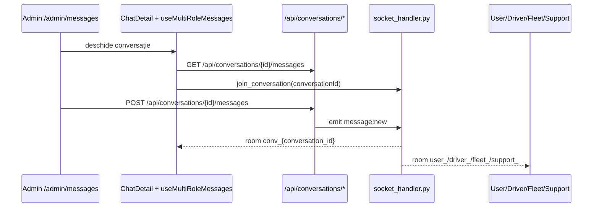
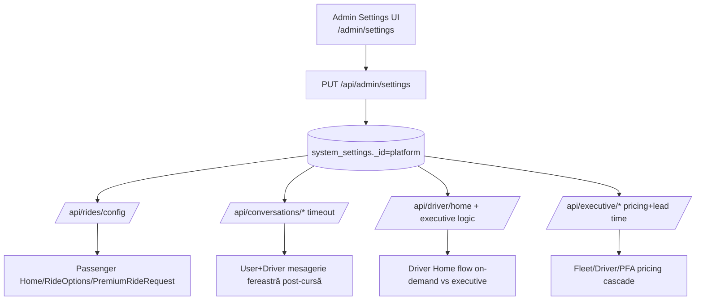

# Admin Dashboard — Brainmap Complet (Admin ↔ Restul Platformei)

Data: 2026-03-01  
Scope: dashboard Admin din `premium.private-driver.ro`, cu legături funcționale către toate rolurile (`user`, `driver`, `fleet_manager`, `support`) și către backend/db/realtime.

## 1) EntryPoint, Guard, Layout

- Frontend guard: toate rutele `/admin/*` sunt protejate cu `requiredRoles=['admin']` în `src/App.tsx`.
- Layout unic: `src/components/admin/AdminLayout.tsx`.
- Backend guard standard admin: `get_admin_user()` în `backend/app/routes/admin.py` (rol strict `admin`).
- Excepție controlată: `backend/app/routes/admin_premium.py` acceptă `admin` și `support` pentru review premium apps.

## 2) Meniuri Admin (complet) + legături către restul platformei

| Meniu | Rută | API principal | Leagă/Administrează |
|---|---|---|---|
| Dashboard | `/admin/dashboard` | `GET /api/admin/dashboard` | KPIs globale user+driver+rides+revenue |
| Trips | `/admin/trips` | `GET /api/admin/trips`, `GET /api/admin/trips/{trip_id}` | curse pasager+șofer |
| Users | `/admin/users` | `GET /api/admin/users`, `PUT /api/admin/user/{id}` | conturi user/driver/fleet/support/admin |
| Drivers | `/admin/drivers-management` | `GET /api/admin/drivers`, `PUT /api/admin/driver/{id}/bypass-documents` | status/compliance șoferi |
| Premium Apps | `/admin/premium-applications` | `GET /api/admin/premium/applications`, `PUT /api/admin/premium/applications/{id}/review` | aprobări premium șoferi |
| Fleets | `/admin/fleets` | `GET /api/admin/fleets` | flote și manageri flotă |
| Vehicles | `/admin/vehicles` | `GET /api/admin/fleet/vehicles/` | parc auto flotă/șoferi |
| Payments | `/admin/payments-payouts` | `GET /api/admin/payments` | plăți client + payout șofer |
| Financial Mgmt | `/admin/financial-management` | `GET /api/admin/trip-financials`, `GET/PUT /api/admin/legal-entities`, `GET /api/invoices/all`, exports ANAF/ARR | relație legală operator-flotă-șofer-client |
| Pricing | `/admin/pricing` | `GET /api/admin/fleet/pricing/config` | reguli tarifare globale/fleet |
| Disputes | `/admin/disputes` | `GET /api/admin/db/collection/disputes` | dispute user↔driver |
| Feedback | `/admin/feedback` | `GET /api/admin/feedback` | rating/calitate user↔driver |
| Audit Logs | `/admin/audit` | `GET /api/audit/logs` | trasabilitate acțiuni multi-rol |
| Analytics | `/admin/analytics` | `GET /api/admin/analytics/overview` | analitice platformă |
| Invoices | `/admin/invoices` | `GET /api/invoices/all`, `POST /api/invoices/generate/ride/{id}` | documente fiscale client/operator |
| Document Verification | `/admin/document-verification` | `GET /api/documents/admin/drivers`, `PUT /api/documents/admin/{id}/verify` | eligibilitate legală șofer |
| Messages | `/admin/messages` | `GET /api/conversations`, `GET /api/conversations/search/messages`, `POST /api/conversations/{id}/messages` | comunicare Admin cu user/driver/fleet/support |
| Support Tickets | `/admin/support-tickets` | `GET /api/support/tickets`, `PUT /api/support/tickets/{id}/status`, `PUT /api/support/tickets/{id}/assign` | management tickete multi-rol |
| Promotions | `/admin/promotions` | `GET /api/promotions/admin/all`, `POST/PUT/DELETE /api/promotions` | promoții pentru user/pasager |
| Referrals | `/admin/referrals` | `GET/PUT /api/referrals/admin/settings`, `GET /api/referrals/admin/stats`, `GET /api/referrals/admin/all` | program referral |
| Settings | `/admin/settings` | `GET/PUT /api/admin/settings`, `GET/POST/PUT/DELETE /api/admin/executive/packages` | setări globale ce afectează toate rolurile |
| Database Explorer | `/admin/database` | `GET /api/admin/db/collections`, `GET/PUT/DELETE /api/admin/db/collection/{name}*` | acces direct pe colecții (impact global) |
| Project Map | `/admin/project-map` | `GET /api/admin/project-map/` | vizualizare structură frontend/backend/db |

## 3) Brainmap Vizual — Admin ↔ Restul

```mermaid
flowchart LR
    A[Admin UI<br/>AdminLayout + /admin/*] --> B[Admin APIs]

    B --> B1[/api/admin/*]
    B --> B2[/api/admin/premium/*]
    B --> B3[/api/support/*]
    B --> B4[/api/conversations/*]
    B --> B5[/api/documents/admin/*]
    B --> B6[/api/invoices | /api/payments | /api/promotions | /api/referrals | /api/audit]

    subgraph R[Roluri Operationale]
      U[Passenger - user]
      D[Driver]
      F[Fleet Manager]
      S[Support]
    end

    B1 --> U
    B1 --> D
    B1 --> F
    B1 --> S
    B2 --> D
    B3 --> U
    B3 --> D
    B3 --> F
    B3 --> S
    B4 --> U
    B4 --> D
    B4 --> F
    B4 --> S
    B5 --> D
    B6 --> U
    B6 --> D
    B6 --> F

    subgraph DB[MongoDB Colecții Cheie]
      C1[users]
      C2[drivers]
      C3[rides]
      C4[bookings]
      C5[fleets]
      C6[documents]
      C7[driver_premium]
      C8[trip_financials]
      C9[support_tickets]
      C10[conversations]
      C11[messages]
      C12[system_settings]
      C13[service_packages]
    end

    B --> DB
```

## 4) Brainmap Vizual — Realtime Mesagerie (Admin inclus)



## 5) Legături critice Admin Settings -> restul rolurilor



## 6) Legături Admin -> colecții (pentru vizualizare rapidă impact)

- Identitate & RBAC: `users`, `drivers`, `fleets`.
- Ride Ops: `rides`, `bookings`.
- Compliance: `documents`, `driver_premium`.
- Finance: `trip_financials`, `invoices`, `service_packages`, `system_settings`.
- Support & Comms: `support_tickets`, `conversations`, `messages`.
- Audit/monitoring: `audit` routes + colecții aferente.

## 7) Fișiere sursă mapate (pentru cross-check tehnic)

- Frontend routing: `src/App.tsx`
- Layout/menu admin: `src/components/admin/AdminLayout.tsx`
- Pagini admin: `src/pages/admin/*.tsx`
- Service API: `src/services/api.ts`
- Backend admin core: `backend/app/routes/admin.py`
- Backend premium review: `backend/app/routes/admin_premium.py`
- Backend support: `backend/app/routes/support.py`
- Backend conversations: `backend/app/routes/conversations.py`
- Backend documents: `backend/app/routes/documents.py`
- Backend project map: `backend/app/routes/project_map.py`
- WebSocket: `backend/app/websocket/socket_handler.py`

## 8) Observații operaționale pentru tine (vizual + control)

- Acesta este map-ul complet Admin ca „control plane”: vezi toate conexiunile Admin cu celelalte roluri în diagramele de mai sus.
- Cea mai sensibilă zonă este `Database Explorer` (write/delete direct în colecții).
- Cea mai mare propagare cross-role vine din `Admin Settings` (scrie în `system_settings`, apoi afectează passenger, driver, mesagerie, pricing executive).
